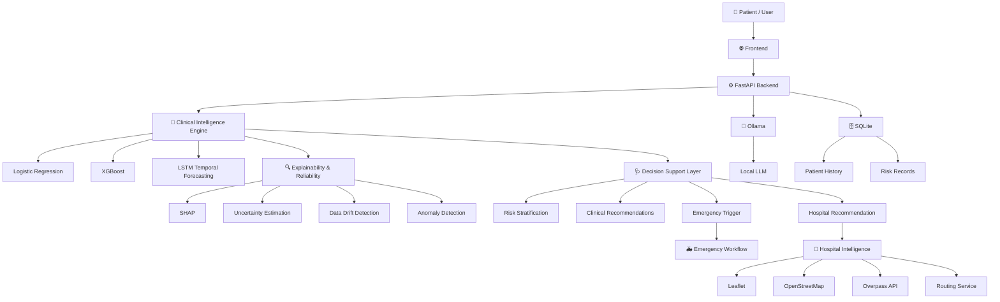

# 🧠 Zemythra

### Clinical Intelligence System for Dynamic Temporal Disease Risk Stratification and Longitudinal Progression Modeling

<p align="center">

**Predict. Explain. Forecast. Recommend. Act.**

</p>

Zemythra is an AI-powered clinical intelligence platform designed to analyze patient health information, estimate disease risk, model longitudinal progression, explain predictions, and support healthcare decision-making through intelligent recommendations and action-oriented workflows.

---

## ✨ Overview

Healthcare risk assessment is often treated as a single prediction problem.

**Zemythra takes a dynamic approach.**

The system combines:

* 🧠 **Disease Risk Prediction**
* 📈 **Temporal Progression Modeling**
* 🔍 **Explainable AI**
* 🛡️ **Prediction Reliability & Anomaly Detection**
* 🤖 **Generative AI Health Assistance**
* 🩺 **Clinical Decision Support**
* 🚨 **Emergency Response Workflows**
* 🏥 **Intelligent Hospital Discovery**
* 📋 **Longitudinal Patient History**

The core idea is:

> **Prediction → Explanation → Forecast → Recommendation → Action**

---

## 🚀 Key Capabilities

### 🧠 AI Risk Prediction

Zemythra analyzes clinical attributes such as:

* Age
* Blood Pressure
* Glucose
* Cholesterol
* BMI
* Heart Rate

The prediction engine generates a risk score and categorizes the patient into clinically interpretable risk levels.

**Risk Levels**

`LOW` → `MODERATE` → `HIGH` → `CRITICAL`

---

### 📈 Temporal Disease Progression

Instead of evaluating patient risk at only one point in time, Zemythra incorporates longitudinal information to analyze how risk evolves.

The temporal intelligence layer supports:

* Historical risk tracking
* Risk progression visualization
* Future risk forecasting
* Longitudinal patient analysis
* Trend-based anomaly detection

**Temporal Model:** LSTM

---

### 🔍 Explainable AI

Zemythra is designed to make model outputs easier to understand.

The explainability layer provides:

* Feature importance
* SHAP-based explanations
* Contributing risk factors
* Interpretable prediction insights

This allows the system to answer:

> **“Why did the model produce this risk?”**

---

### 🛡️ Reliability & Monitoring

The platform incorporates additional reliability mechanisms beyond the prediction itself.

* Prediction uncertainty
* Data drift monitoring
* Risk anomaly detection
* Critical threshold detection
* Risk trend monitoring

This helps distinguish between a normal prediction and a potentially abnormal change in patient risk.

---

### 🤖 Generative AI Health Assistant

Zemythra includes a local AI-powered health assistant using **Ollama**.

The assistant can support:

* Health-related queries
* Risk explanations
* Follow-up questions
* General health guidance
* AI-assisted interpretation of supported health information

The local inference approach allows the project to run an LLM locally without requiring a paid cloud LLM API.

---

### 🩺 Clinical Decision Support

Zemythra converts model outputs into actionable recommendations.

Depending on the detected risk level, the system can provide:

* 🥗 Diet recommendations
* 🏃 Exercise and activity guidance
* 💧 Lifestyle recommendations
* 🧘 Preventive health suggestions
* 👨‍⚕️ Consultation guidance
* 🚨 Critical-risk actions

---

### 🚨 Emergency Response

For critical-risk scenarios, Zemythra provides an emergency-response workflow.

The system supports:

* Critical-risk trigger
* Emergency status
* Ambulance dispatch simulation
* ETA display
* Hospital destination
* Route visualization
* Emergency contact workflow

> **Note:** The current ambulance functionality is a prototype/simulation and is not connected to a real emergency-dispatch network.

---

### 🏥 Intelligent Hospital Discovery

The hospital intelligence module uses the patient's location to identify nearby healthcare facilities.

Features include:

* 📍 Live browser location
* 🏥 Nearby hospital search
* 📏 Distance calculation
* 🩺 Specialization information
* 👨‍⚕️ Doctor/contact information where available
* 🗺️ Interactive map
* 🛣️ Route visualization

The project uses open mapping technologies rather than requiring Google Maps.

---

### 📊 Clinical Monitoring Dashboard

The dashboard provides a centralized view of patient intelligence.

It includes:

* Current risk score
* Confidence information
* Live risk visualization
* Risk progression
* Anomaly highlighting
* Patient history
* ECG-style monitoring visualization
* Lifestyle recommendations

---

## 🏗️ System Architecture



---

## 🔄 End-to-End Workflow

```text
👤 Patient
   │
   ▼
🔐 Authentication
   │
   ▼
📋 Clinical Information
   │
   ▼
🧠 AI Risk Prediction
   │
   ▼
📊 Risk Score
   │
   ├───────────────┐
   ▼               ▼
🔍 Explanation   📈 Temporal Forecast
   │               │
   └───────┬───────┘
           ▼
      🩺 Decision Support
           │
     ┌─────┼──────────────┐
     │     │              │
     ▼     ▼              ▼
   🥗     🏥             🚨
Lifestyle Hospital      Emergency
Advice    Discovery      Response
     │       │              │
     └───────┴──────────────┘
             ▼
       📋 Patient History
```

---

## 🛠️ Technology Stack

### 💻 Languages

| Technology   | Usage                              |
| ------------ | ---------------------------------- |
| 🐍 Python    | AI, ML, backend and APIs           |
| ⚡ JavaScript | Frontend logic and API integration |
| 🌐 HTML5     | Web interface                      |
| 🎨 CSS3      | UI styling                         |

### 🧠 Artificial Intelligence

| Technology         | Usage                      |
| ------------------ | -------------------------- |
| Scikit-learn       | Classical machine learning |
| XGBoost            | Risk prediction            |
| TensorFlow / Keras | Deep learning              |
| LSTM               | Temporal forecasting       |
| SHAP               | Explainable AI             |
| NumPy              | Numerical computation      |
| Pandas             | Data processing            |
| Joblib             | Model persistence          |

### 🤖 Generative AI

| Technology         | Usage                            |
| ------------------ | -------------------------------- |
| Ollama             | Local LLM runtime                |
| Local LLM          | Conversational health assistance |
| Prompt Engineering | Response generation              |

### ⚙️ Backend

| Technology | Usage              |
| ---------- | ------------------ |
| FastAPI    | REST API framework |
| Uvicorn    | ASGI server        |
| Pydantic   | Data validation    |

### 🎨 Frontend

| Technology   | Usage                              |
| ------------ | ---------------------------------- |
| HTML5        | Page structure                     |
| JavaScript   | Application logic                  |
| Tailwind CSS | UI styling                         |
| Chart.js     | Risk and monitoring visualizations |
| Leaflet      | Interactive maps                   |

### 🗺️ Location & Mapping

| Technology              | Usage               |
| ----------------------- | ------------------- |
| OpenStreetMap           | Map data            |
| Overpass API            | Hospital discovery  |
| Browser Geolocation API | Live user location  |
| Open routing services   | Route visualization |

### 🗄️ Storage & Security

| Technology       | Usage                            |
| ---------------- | -------------------------------- |
| SQLite           | Patient history and risk records |
| JWT              | Authentication                   |
| Password hashing | Credential protection            |

---

## 📂 Project Structure

```text
Zemythra/
│
├── backend/
│   ├── api.py
│   ├── auth.py
│   ├── chat_service.py
│   ├── db.py
│   ├── decision.py
│   ├── main.py
│   ├── model.py
│   └── temporal_model.py
│
├── frontend/
│   ├── homepage.html
│   ├── login.html
│   ├── chatbot.html
│   ├── dashboard.html
│   ├── hospitals.html
│   └── emergency.html
│
├── client/
│   └── React frontend
│
├── data/
│   ├── raw/
│   └── processed/
│
├── .gitignore
├── README.md
└── requirements.txt
```

---

## 🔌 Main API Endpoints

| Endpoint               | Purpose                       |
| ---------------------- | ----------------------------- |
| `POST /predict`        | Disease-risk prediction       |
| `POST /chat`           | AI health assistant           |
| `POST /chat/stream`    | Streaming AI response         |
| `POST /report`         | Health report generation      |
| `GET /history`         | Retrieve patient risk history |
| `POST /save-history`   | Store prediction history      |
| `POST /login`          | Authentication                |
| `POST /emergency-real` | Emergency-response workflow   |
| `POST /hospitals`      | Hospital recommendation       |

Interactive documentation:

**http://127.0.0.1:8000/docs**

---

## ⚡ Getting Started

### 1. Clone the repository

```bash
git clone https://github.com/Clinical-Intelligence-System/Zemythra.git

cd Zemythra
```

### 2. Create a virtual environment

#### macOS / Linux

```bash
python3 -m venv venv

source venv/bin/activate
```

#### Windows

```bash
python -m venv venv

venv\Scripts\activate
```

### 3. Install dependencies

```bash
pip install -r requirements.txt
```

### 4. Start Ollama

Open a separate terminal:

```bash
ollama serve
```

Check available models:

```bash
ollama list
```

### 5. Start the backend

From the project root:

```bash
uvicorn backend.main:app --reload
```

Backend:

```text
http://127.0.0.1:8000
```

Swagger API documentation:

```text
http://127.0.0.1:8000/docs
```

### 6. Start the frontend

Open another terminal:

```bash
cd frontend

python3 -m http.server 5500
```

Open:

```text
http://localhost:5500/homepage.html
```

---

## 🧪 Development Setup

The recommended local development environment uses:

```text
Terminal 1 → Ollama
Terminal 2 → FastAPI Backend
Terminal 3 → Frontend Server
```

### Ollama

```bash
ollama serve
```

### Backend

```bash
uvicorn backend.main:app --reload
```

### Frontend

```bash
cd frontend
python3 -m http.server 5500
```

---

## 📈 Intelligence Pipeline

Zemythra combines multiple intelligence layers:

### 1. Prediction

Clinical data is processed by machine-learning models to estimate disease risk.

### 2. Stratification

The predicted risk is translated into understandable severity levels.

### 3. Explainability

The system identifies important contributing factors behind predictions.

### 4. Reliability

Uncertainty, anomaly behavior, and possible drift are monitored.

### 5. Temporal Analysis

Historical observations are used to model risk progression and forecast future trends.

### 6. Decision Support

The system converts the intelligence into recommendations and possible actions.

---

## 🌟 Why Zemythra?

Most predictive systems stop at:

> **“The patient has X% risk.”**

Zemythra is designed to continue beyond the prediction:

```text
What is the risk?
        ↓
Why is the risk elevated?
        ↓
How is the risk changing?
        ↓
What could happen next?
        ↓
What should the patient do?
        ↓
Where should the patient go?
        ↓
What should happen in an emergency?
```

This makes Zemythra an **action-oriented clinical intelligence platform**, rather than a prediction-only application.

---

## 🔐 Security & Privacy

This is a public repository.

Never commit:

* ❌ Passwords
* ❌ API keys
* ❌ JWT secrets
* ❌ `.env` files
* ❌ Personal credentials
* ❌ Sensitive patient information
* ❌ Production database files

Use environment variables and secure secret management for sensitive configuration.

---

## ⚠️ Disclaimer

Zemythra is an **AI healthcare research and prototype platform**.

It is not a substitute for qualified medical professionals, diagnosis, treatment, or emergency medical services.

AI-generated predictions and recommendations should be reviewed by appropriate healthcare professionals before being used for real-world medical decisions.

The emergency-response and ambulance features are prototype workflows and are not connected to a real emergency-dispatch network.

---

## 🔮 Future Scope

* 🩻 Multimodal medical-image analysis
* ⌚ Wearable-device integration
* ❤️ Continuous physiological monitoring
* 🏥 Hospital information-system integration
* 🚑 Real emergency-service integration
* 📍 Real-time ambulance tracking
* ☁️ Cloud deployment
* 🗄️ PostgreSQL production storage
* 👨‍⚕️ Advanced doctor dashboard
* 🔄 Automated model retraining
* 🧪 Clinical validation

---