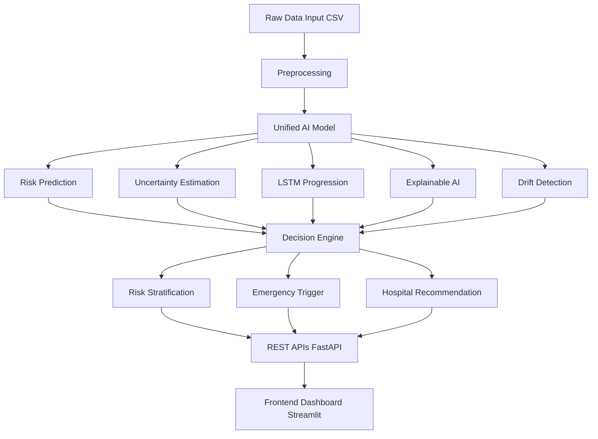

# Zemythra 
# Major Project C

# 🎓 Project Overview

This project presents a Clinical Intelligence System designed to predict disease risk, analyze temporal disease progression, and support clinical decision-making using Machine Learning, Deep Learning (LSTM), and Explainable AI.

The system helps in:

* Estimating current disease risk
* Forecasting future risk trends
* Explaining why a patient is at risk
* Triggering emergency alerts
* Recommending appropriate healthcare facilities
 

This project is developed as a Final Year B.Tech Major Project (JNTUH).

---

# 👥 Team Information

* Team Size: 2
* Development Environment:
  * Member 1: macOS
  * Member 2: Windows 10 Pro
* IDE Used: Visual Studio Code (VS Code)

Both team members worked simultaneously from Day-1 to Day-30 using Git for collaboration.  

---

# 🧠 Key Features

🟢 Core Features :

* Disease Risk Prediction (Machine Learning)
* Temporal Disease Progression Modeling (LSTM)
* Risk Stratification (Low / Medium / High)
* Explainable AI using SHAP
* Patient Health Timeline Visualization

🟡 Advanced Features :

* Prediction Uncertainty Estimation
* Data Drift Detection
* Multimodal Fusion (Future Scope)

🔵 Secondary Features :

* Emergency Risk Trigger
* Rule-based Hospital Recommendation
 

# 🖥️ System Architecture & components

* System Components

| S.No | Stage            | Components                                                                 |
|------|------------------|----------------------------------------------------------------------------|
| 1    | Raw Data Input   | Raw Clinical Data (CSV)                                                    |
| 2    | Preprocessing    | Data Preprocessing                                                         |
| 3    | AI Model         | Risk Prediction, Uncertainty Estimation, LSTM Progression, Explainable AI, Drift Detection |
| 4    | Decision Engine  | Risk Stratification, Emergency Trigger, Hospital Recommendation            |
| 5    | API Layer        | REST APIs (FastAPI)                                                        |
| 6    | Frontend         | Streamlit Dashboard                                                        |

# 📂 Project Structure 

1. **backend(b)/** 
   -  ↳ data/
    -  ↳ raw/
       - /clinical_risk_data.csv  
       - /patient_time_series.csv  
       - /risk_thresholds.csv  
       - /feature_descriptions.csv  
   - b/model.py → ML, LSTM, Explainability, Drift  
   - b/decision.py → Risk & Emergency Logic  
   - b/api.py → REST APIs  
   - b/main.py → Application Entry Point  

3. **frontend/**
   - ↳ app.py → Streamlit Dashboard  

4. **README.md**

5. **requirements.txt**

# 📊 Datasets Used

1) Clinical Risk Dataset

* Age
* Blood Pressure
* Glucose
* Cholesterol
* BMI
* Heart Rate
* Disease Label

2) Patient Time-Series Dataset

* Monthly health records
* Risk score evolution over time

# ⚙️ Technologies & Libraries

* Programming Language: Python 3.9+  
*Machine Learning & AI: scikit-learn, TensorFlow / Keras, SHAP, NumPy, Pandas  
* Backend: FastAPI, Uvicorn  
* Frontend: Streamlit  
* Tools: VS Code, Git & GitHub

▶️ How to Run the Project (VS Code) :

1) Clone the Repository
Bash :
git clone https://github.com/your-username/clinical-intelligence-system.git
cd clinical-intelligence-system

2) Create & Activate Virtual Environment :
   * Windows: python -m venv venv followed by venv\Scripts\activate   

   * macOS / Linux: python3 -m venv venv followed by source venv/bin/activate

3) Install Dependencies
Bash:
pip install fastapi uvicorn pandas numpy scikit-learn tensorflow shap streamlit joblib

4) Train Risk Model (First Time)
Bash:
python backend/model.py

5) Run Backend Server
Bash :
uvicorn backend.main:app --reload

🔹 Backend will run at:
   * Backend: http://127.0.0.1:8000

🔹 APi docs will be seen at:   
   * API Docs: http://127.0.0.1:8000/docs

6) Run Frontend Dashboard 
Bash:
streamlit run frontend/app.py

🔹 Frontend will open at:
   * Frontend: http://localhost:8501

# 📈 Results & Evaluation

* Logistic Regression used for baseline risk prediction  
* LSTM used for temporal risk forecasting  
* SHAP values used for explainability  
* Risk stratification improves clinical interpretability

# 🔮 Future Scope

* Multimodal data fusion (clinical + imaging)
* Real-time monitoring from wearable devices
* Automated model retraining
* Integration with hospital information systems

# 🏁 Conclusion

This project demonstrates how AI-driven clinical intelligence systems can assist healthcare professionals by providing accurate, explainable, and time-aware disease risk assessments.
The system is modular, scalable, and suitable for real-world clinical decision support.

# 📜 License
This project is developed for "academic purposes only" under JNTUH curriculum and © copyrights are reserved.

# 📦 requirements.txt 

* fastapi  
* uvicorn  
* pandas  
* numpy  
* scikit-learn  
* tensorflow  
* shap  
* joblib  
* scipy  
* streamlit  
* requests  
